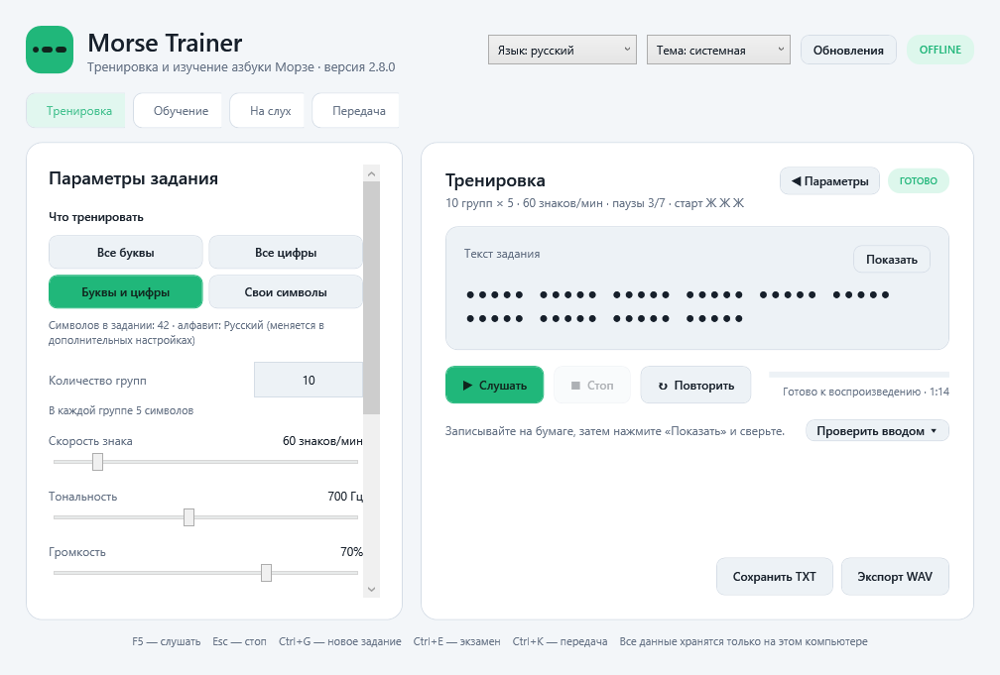
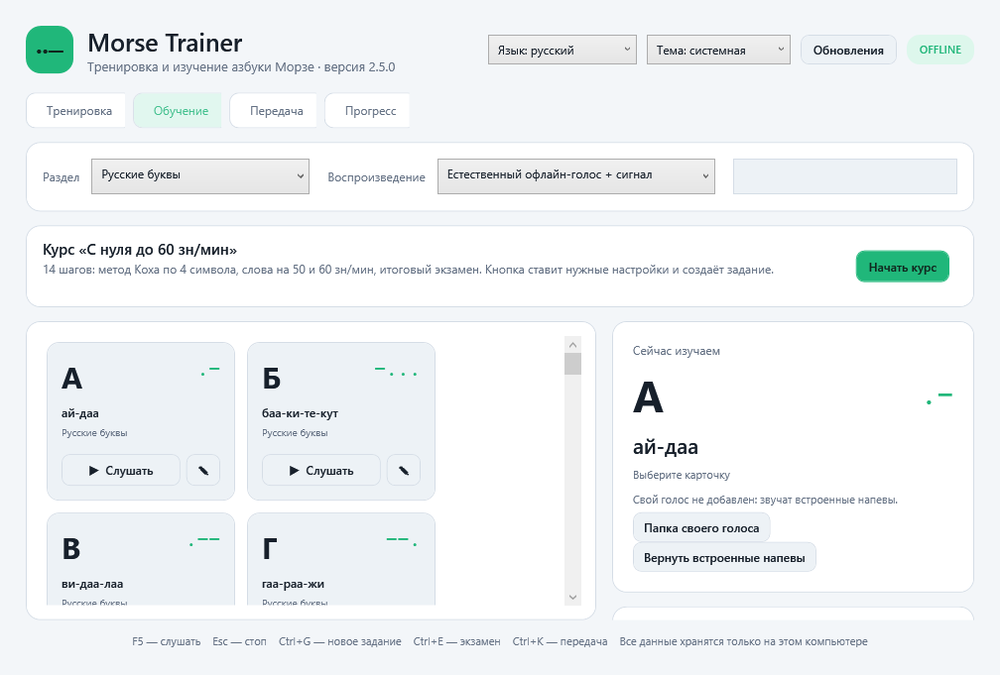
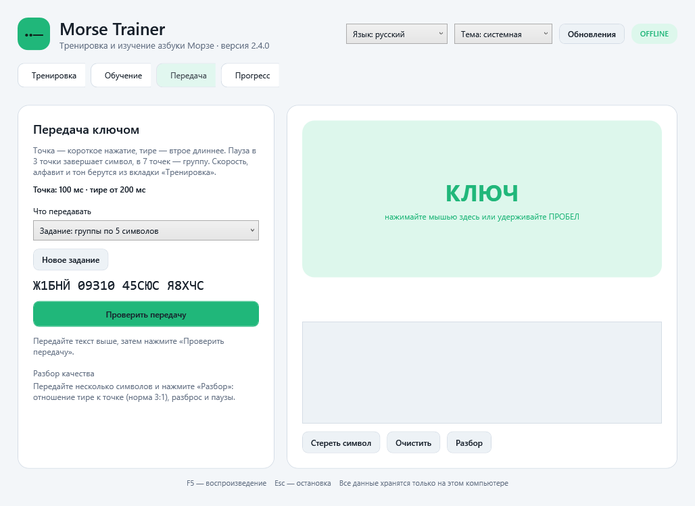
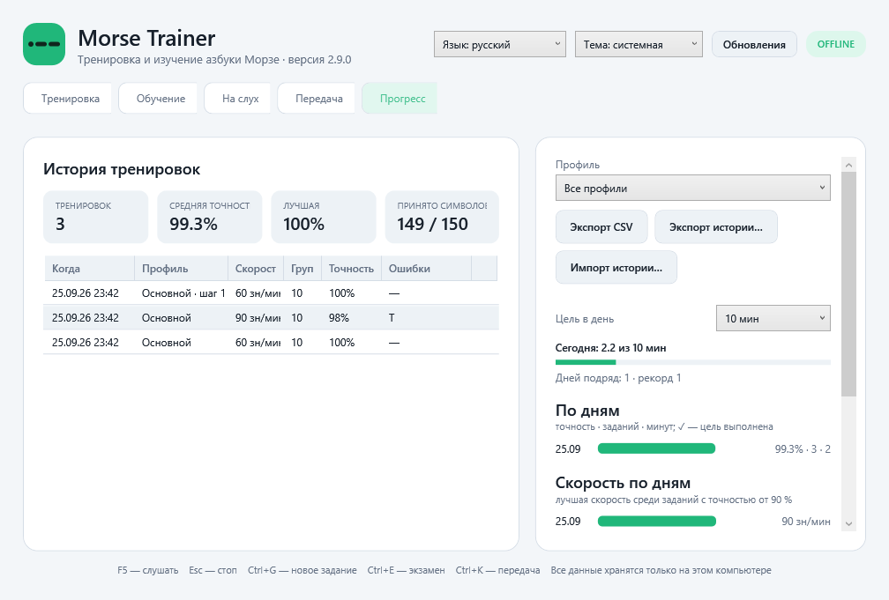

<div align="center">
  
  <h1>Morse Trainer</h1>
  <p>Автономный тренажёр азбуки Морзе для Windows, Android и iPhone</p>
  <p>
    <a href="https://github.com/nevadimka1415/morse/actions/workflows/build.yml"></a>
    <a href="https://github.com/nevadimka1415/morse/actions/workflows/mobile.yml"></a>
    <a href="https://github.com/nevadimka1415/morse/releases/latest"></a>
    <a href="LICENSE"></a>
  </p>
</div>

## Возможности

- русский и латинский алфавиты, цифры и знаки препинания;
- случайные задания из групп по пять символов;
- режимы «Слова» (русские и английские слова по выбранному алфавиту), «Позывные» (случайные позывные вида R3ABC, DL1AB, W1AW) и «Q-код и сокращения» (QRZ, QTH, CQ, DE, 73…): вместо групп звучат слова, проверка по словам;
- символы с одинаковым кодом (А/A, Р/R, Е/Ё) при проверке считаются совпадением: на слух они неразличимы;
- визуальный выбор конкретных символов для тренировки — например, только `А`, `Г`, `Ж`, `Д`;
- метод Коха: символы добавляются по одному в проверенном порядке, после каждой проверки подсказка, пора ли на следующий уровень;
- умное повторение: символы с ошибками из истории и новый символ Коха звучат чаще;
- «Повторить сложные символы» одной кнопкой (Windows и телефон): задание только из символов, в которых вы чаще всего ошибались за последние 100 заданий, и похожих на них по коду (отличие в один-два элемента); сложные звучат втрое чаще;
- пресет Фарнсворта: быстрые знаки с растянутыми паузами одной кнопкой;
- передача ключом: вкладка «Передача» на Windows (мышь или пробел) и на телефоне (кнопка-ключ): нажатия превращаются в точки и тире, текст декодируется на лету, есть задание с проверкой;
- разбор качества ключа: кнопка «Разбор» показывает отношение тире к точке (норма 3:1), разброс длительностей и паузы внутри символа, между символами и группами с подсказками («тире коротковаты», «паузы внутри символа затянуты»);
- скорость 20–300 знаков в минуту;
- авто-скорость (лестница): два задания подряд с точностью от 90 % — +5 знаков/мин, задание ниже 70 % — сразу −5; хранится в профиле;
- тон 300–1200 Гц, громкость, отдельные паузы между символами и группами;
- помехи эфира: шум приёмника (QRN) 0–100 %, замирания (QSB) 0–100 % и дрейф тона до ±50 Гц; профиль хранит настройки помех, экспорт WAV их включает;
- обязательный настраиваемый старт: `Ж Ж Ж`, пауза, затем группы задания;
- воспроизведение, остановка и повтор задания;
- экзамен: задание с текущими параметрами, 1–3 прослушивания и лимит времени на выбор (по истечении ответ проверяется сам), ответ скрыт, идёт время; после проверки — протокол (точность, ошибки по символам, позиции, время, правила) с сохранением в TXT на Windows и «Поделиться» на телефоне, запись в истории с пометкой «экзамен»; на «Прогрессе» — серия последних пяти экзаменов с трендом;
- скрытый правильный ответ;
- ввод услышанного текста и автоматическая проверка;
- точность, позиции ошибок и сложные символы за текущую сессию;
- история тренировок между запусками: вкладка «Прогресс» с точностью по дням, средним и лучшим результатом и сложными символами за всё время (на Windows и на телефоне);
- прогресс по профилю: фильтр «Все профили / имя профиля» на вкладке «Прогресс»; экспорт истории в CSV для Excel («Экспорт CSV» на Windows, «Поделиться CSV» на телефоне);
- цель «минут в день» (5–60 мин или без цели) с отметкой ✓ по дням, серия дней подряд с рекордом и скорость по дням (лучшая скорость среди заданий с точностью от 90 %) — на вкладке «Прогресс» на Windows и на телефоне;
- экспорт задания в TXT и звука в WAV;
- автоматическое сохранение последних настроек;
- именованные профили сохраняют количество групп, скорость, тональность, громкость, паузы и набор символов;
- перенос профилей между устройствами: экспорт и импорт файла на Windows, «Поделиться» и «Вставить из буфера» на телефоне;
- перенос истории тренировок между устройствами: «Экспорт истории…» / «Импорт истории…» (файл JSON) на Windows, «Поделиться историей» и «Импорт истории» (из файла или буфера обмена) на телефоне; записи сливаются по времени, повторы пропускаются;
- системная, тёмная и светлая темы;
- на планшетах и в альбомной ориентации контент не растягивается: полоса до 720 px и больше колонок карточек;
- английский интерфейс: переключатель «Язык» (системный, русский, English) на Windows и на телефоне, применяется после перезапуска;
- вкладка «Обучение» с карточками русских и латинских букв и цифр;
- словесные напевы (`А — ай-даа`, `Б — баа-ки-те-кут`) с подсветкой ритма;
- два варианта обучения: напев на экране или естественный встроенный голос, затем сигнал Морзе;
- проверочные задания на слух со счётом правильных ответов;
- свои напевы: кнопка «✎» на карточке обучения (Windows и телефон) — свой напев с проверкой ритма (слог на каждую точку и тире), «Вернуть встроенные напевы»; свои напевы переносятся вместе с профилями;
- свой голосовой пакет: записи `code_XXXX.wav` (на телефоне также `.m4a`, `.mp3`; точка — 0, тире — 1, «А» → `code_01`) в папке `voice` рядом с данными заменяют встроенный голос; на Windows кнопка «Папка своего голоса», на телефоне «Свой голос…» → «Добавить файлы»;
- напоминание о тренировке на телефоне: переключатель и время в настройках, ежедневное локальное уведомление (Android — будильник, восстанавливается после перезагрузки; iPhone — календарное уведомление);
- напоминание на Windows: при запуске плашка «Вы не тренировались N дн.», если пропущено два дня и больше; на вкладке «Прогресс» — «Напоминать уведомлением Windows» в выбранное время, пока программа открыта (можно свернуть);
- полностью автономная работа без регистрации и интернета;
- кнопка «Обновления»: по нажатию проверяет новую версию на GitHub; на Windows скачивает установщик и запускает обновление одной кнопкой, на телефоне открывает загрузку APK (единственное действие, которому нужен интернет);
- Windows запоминает размер окна и открытую вкладку между запусками; окно помещается на экран 1366×768 (минимум 1000×680), панель параметров тренировки сворачивается кнопкой «◀ Параметры», таблица истории подстраивается под ширину без горизонтальной прокрутки.

Мобильная версия использует тот же алгоритм и офлайн-пакет напевов. Android устанавливается из APK, а iPhone-версия собирается из той же кодовой базы и требует подписи Apple. Подробности: [MOBILE.md](MOBILE.md).

## Скриншоты

Снимки окна Windows делает дымовой UI-тест в CI (`docs/screenshots`, обновляются вручную из артефакта `MorseTrainer-Screenshots`).

| Тренировка | Обучение |
|---|---|
|  |  |

| Передача ключом | Прогресс |
|---|---|
|  |  |

Английский интерфейс: [training-en.png](docs/screenshots/training-en.png).

## Скачать готовую программу

Откройте **Releases** в репозитории и выберите один из файлов:

- `MorseTrainer-Setup-x64.exe` — обычная установка с ярлыком;
- `MorseTrainer-Windows-x64.zip` — переносная версия без установки;
- `MorseTrainer-Android.apk` — приложение для Android: откройте страницу Releases в браузере телефона и нажмите на файл, затем разрешите установку;
- `MorseTrainer-iOS-unsigned.ipa` — сборка для iPhone без подписи Apple: ставится через Sideloadly или AltStore со своим Apple ID, подробности в [MOBILE.md](MOBILE.md).

Прямая ссылка на последний APK для телефона: <https://github.com/nevadimka1415/morse/releases/latest/download/MorseTrainer-Android.apk>

В каждом релизе лежит `SHA256SUMS.txt` с контрольными суммами всех файлов. Проверить скачанный файл на Windows: `certutil -hashfile MorseTrainer-Setup-x64.exe SHA256`, на Linux и macOS: `sha256sum -c SHA256SUMS.txt`.

Приложение собирается как self-contained EXE: устанавливать .NET пользователю не требуется.

## Быстрые клавиши

| Клавиша | Действие |
|---|---|
| `Ctrl+G` | Создать новое задание |
| `F5` | Воспроизвести или повторить |
| `Esc` | Остановить воспроизведение |

## Сборка на Windows

Требования для разработчика:

- [.NET SDK 10](https://dotnet.microsoft.com/download/dotnet/10.0);
- [Inno Setup 6](https://jrsoftware.org/isinfo.php) — только для установщика.

Для обычного запуска исходников дважды щёлкните `START-MORSE-TRAINER.cmd`.
Перед загрузкой на GitHub запустите `CHECK-BEFORE-GITHUB.cmd`: он проверит SDK, выполнит тесты и соберёт приложение.
Окно запуска теперь остаётся открытым после завершения программы. Ошибки сборки сохраняются в `morse-start.log`, а ошибки самого приложения — в `%LOCALAPPDATA%\MorseTrainer\crash.log`.

Чтобы получить один запускаемый файл, дважды щёлкните `BUILD-EXE.cmd`. После успешной сборки откроется папка `release` с готовым `MorseTrainer.exe`. Эта локальная сборка использует уже установленную среду .NET 10 и не скачивает крупные runtime-пакеты. Для других компьютеров без .NET используйте полностью автономный EXE из GitHub Release.

```powershell
.\scripts\build.ps1
```

Готовые файлы появятся в `dist`. Для сборки только переносной версии:

```powershell
.\scripts\build.ps1 -SkipInstaller
```

## Мобильная сборка

После загрузки исходников GitHub Actions автоматически собирает Android APK и проверяет сборку iPhone для симулятора. Откройте **Actions → Build mobile apps**. Android-файл находится в артефакте `MorseTrainer-Android`.

Apple не разрешает устанавливать неподписанный файл на настоящий iPhone. Для установки потребуется Mac, Xcode и подпись Apple ID; для передачи другим пользователям — TestFlight или App Store. Полная памятка находится в [MOBILE.md](MOBILE.md).

## Проверки

Проект содержит автономный тестовый запуск без сторонних тестовых библиотек:

```powershell
dotnet run --project .\tests\MorseTrainer.Tests\MorseTrainer.Tests.csproj -c Release
```

Проверяются таблицы Морзе, полный каталог напевов, соответствие слогов коду, генерация групп, проверка ответа и корректность WAV-файла. GitHub Actions автоматически выполняет проверки перед каждой сборкой и публикацией релиза.

Дымовой тест интерфейса Windows (`tests/MorseTrainer.UiSmoke`) поднимает настоящее окно программы, переключает вкладки, генерирует и проверяет задание, нажимает основные кнопки и убеждается, что переводы и привязки живые. Он запускается из `scripts\build.ps1` перед публикацией (пропустить: `-SkipUiSmoke`), а скриншоты окна попадают в `dist\screenshots`. Данные теста пишутся во временную папку (`MORSETRAINER_DATA_DIR`), настройки пользователя не затрагиваются.

## Как устроен проект

- `src/MorseTrainer` — WPF-приложение для Windows на C# и .NET 10;
- `src/MorseTrainer.Mobile` — мобильный интерфейс .NET MAUI для Android и iPhone;
- `src/MorseTrainer.Core` — общая логика Морзе, используемая мобильным приложением;
- `Domain` — алфавиты, напевы, генерация задания и проверка ответа;
- `Services` — синтез WAV, встроенный голос, темы, профили и хранение локальных настроек;
- `tests` — автономные проверки основной логики (`MorseTrainer.Tests`), дымовой UI-тест Windows (`MorseTrainer.UiSmoke`) и дымовой тест APK на Android-эмуляторе (`android-smoke.py`, скриншоты — в артефакте `MorseTrainer-Screenshots-Android`);
- `installer` — сценарий установщика Inno Setup;
- `.github/workflows` — сборка EXE и публикация Releases.

Настройки сохраняются в `%LOCALAPPDATA%\MorseTrainer`. Программа не отправляет данные во внешние сервисы.

Словесные напевы — учебная мнемоника, а не часть международного стандарта Морзе. Для латинской буквы используется русский напев буквы с тем же кодом: например, `W (.--)` получает напев `ви-даа-лаа`.

## Лицензия

[MIT](LICENSE)
